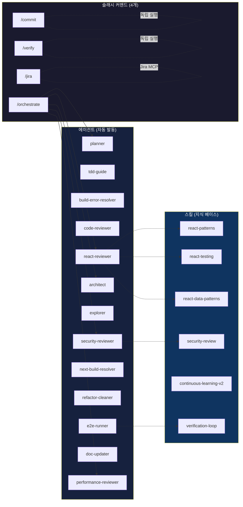
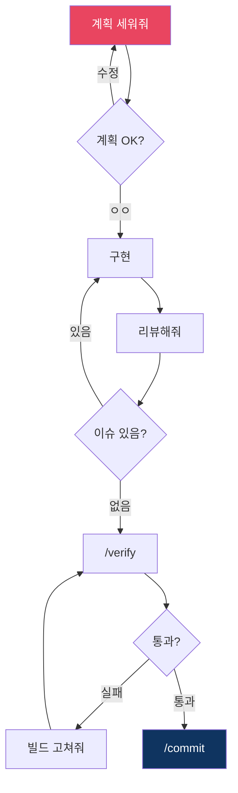
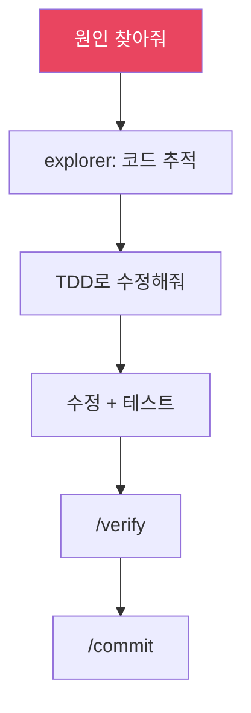
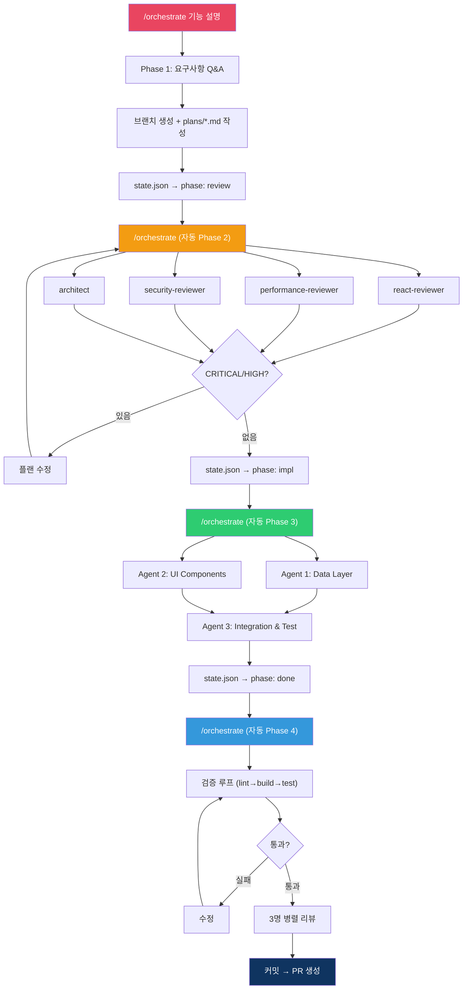
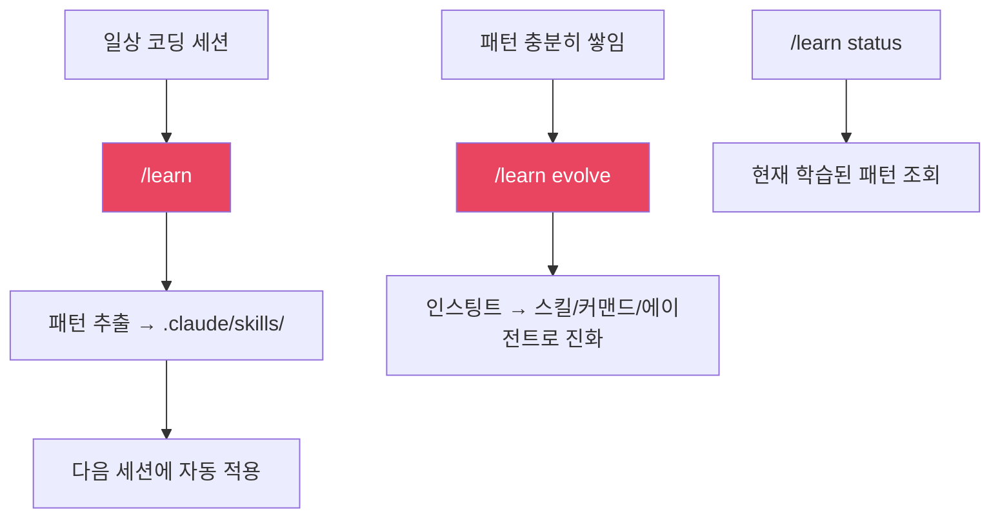
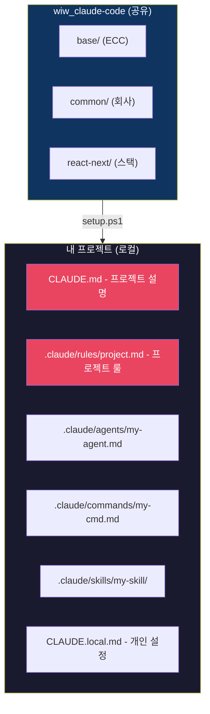

# React/Next.js 프로젝트 가이드

## 전체 구조 마인드맵

```mermaid
mindmap
  root((React/Next.js<br/>Claude Code))
    **커맨드 (4개)**
      /orchestrate
        "4-Phase 파이프라인"
        "state.json 상태 추적"
      /commit
        "conventional commit 자동"
      /verify
        "lint + build + test"
      /jira
        "bug/task 이슈 생성"
    **자동 에이전트 (자연어로 호출)**
      planner
        "계획 세워줘"
      tdd-guide
        "TDD로 해줘"
      code-reviewer
        "코드 리뷰해줘"
      react-reviewer
        "React 리뷰해줘"
      build-error-resolver
        "빌드 고쳐줘"
      next-build-resolver
        "Next.js 빌드 에러"
      performance-reviewer
        "성능 점검해줘"
      security-reviewer
        "보안 점검해줘"
      refactor-cleaner
        "안 쓰는 코드 정리해줘"
      explorer
        "원인 찾아줘"
    **학습**
      /learn
        "패턴 추출/조회/진화 통합"
```

## 커맨드 → 에이전트 → 스킬 의존성



## 워크플로우별 사용법

### 1. 새 기능 개발



### 2. 버그 수정



### 3. 멀티 에이전트 파이프라인



### 4. 학습 시스템



## Rules가 하는 일 (자동, 유저 개입 없음)

```mermaid
flowchart LR
    subgraph rules["항상 자동 적용되는 룰"]
        direction TB
        r1["git-workflow: 브랜치/커밋 규칙"]
        r2["coding-style: 네이밍, 포맷"]
        r3["security: 보안 패턴 강제"]
        r4["testing: 테스트 규칙"]
        r5["patterns: 디자인 패턴"]
        r6["claude-usage: 모델 선택 가이드"]
        r7["typescript/*: TS 전용 규칙"]
        r8["pull-request: PR 템플릿 (Jira 키)"]
        r9["jira: Jira 이슈 규칙"]
    end

    Claude["Claude Code"] --> rules
    rules --> |"코드 작성 시<br/>자동 반영"| Output["더 나은 코드"]

    style rules fill:#1a1a2e,color:#fff
    style Claude fill:#e94560,color:#fff
```



## 프로젝트 커스터마이징



| 파일 | 용도 | git 커밋 |
|------|------|----------|
| `CLAUDE.md` | 프로젝트 개요, 기술 스택, 빌드 방법 | O |
| `.claude/rules/project.md` | 이 프로젝트만의 코딩 규칙 | O |
| `.claude/agents/my-*.md` | 프로젝트 전용 에이전트 | O |
| `.claude/commands/my-*.md` | 프로젝트 전용 커맨드 | O |
| `.claude/skills/my-*/` | 프로젝트 전용 스킬 | O |
| `CLAUDE.local.md` | 개인 설정 (gitignore) | X |
| `.claude/.env` | 토큰 (gitignore) | X |
